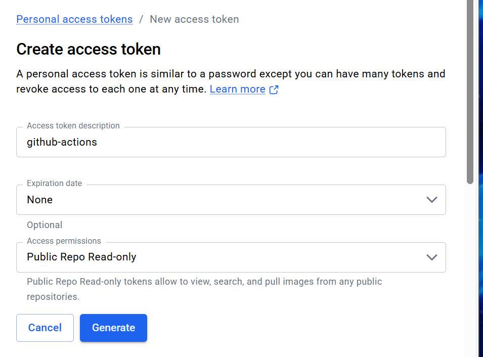
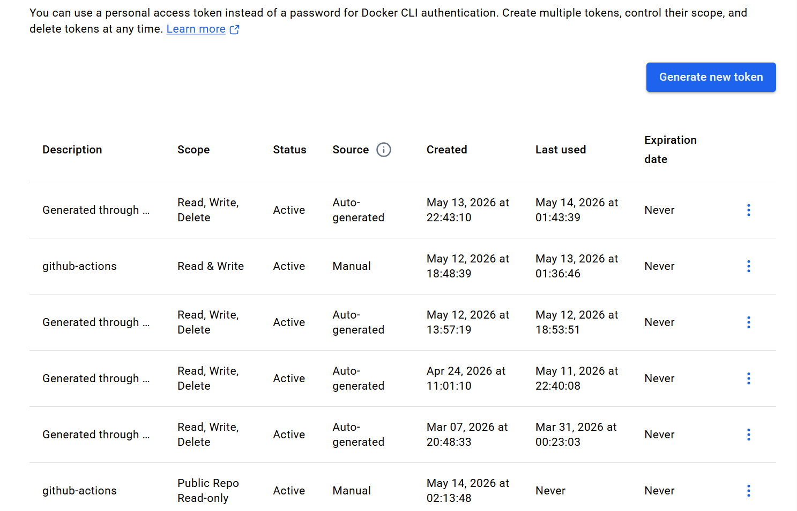
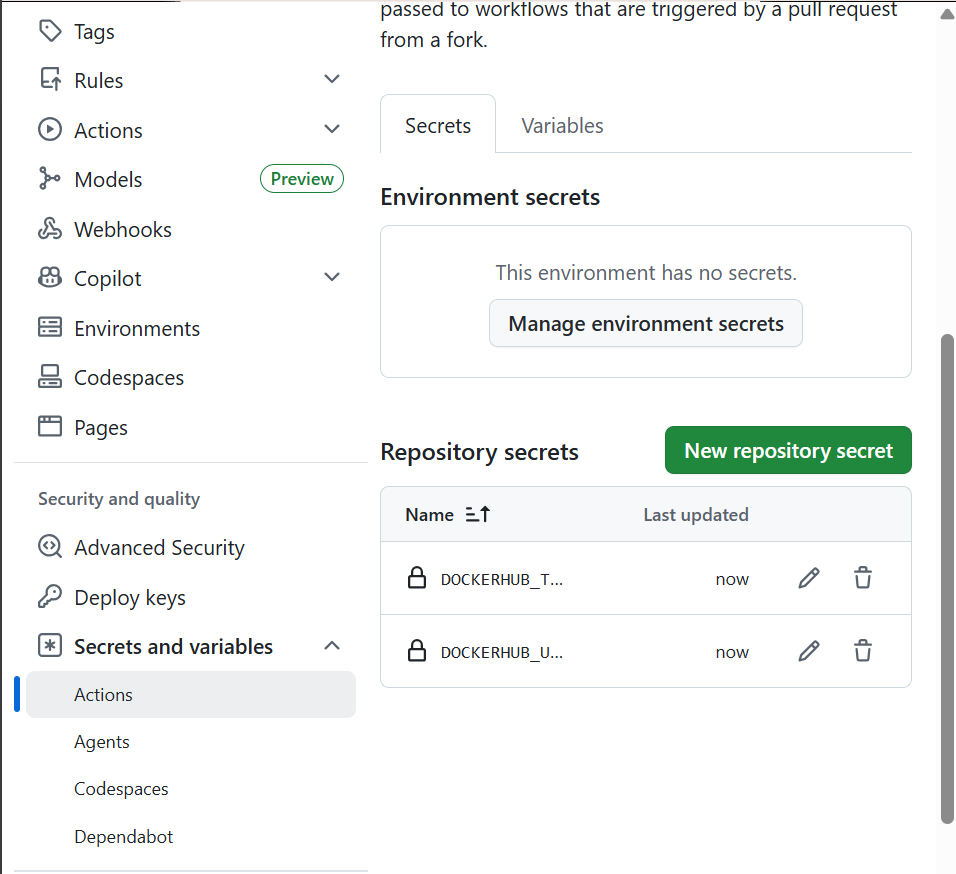
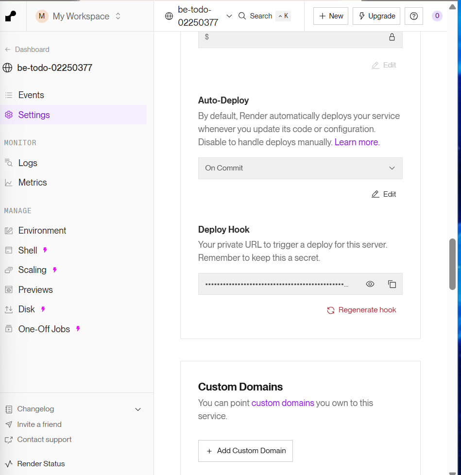
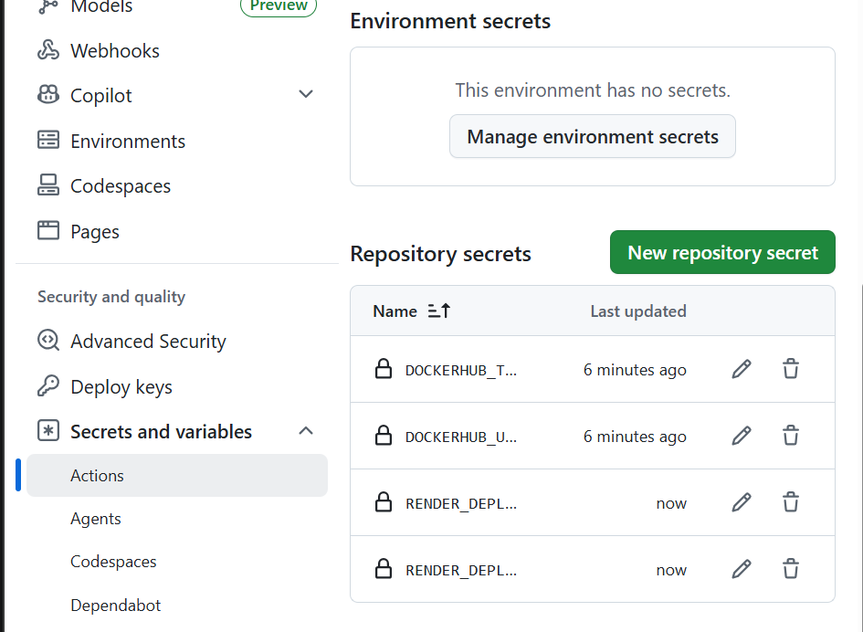
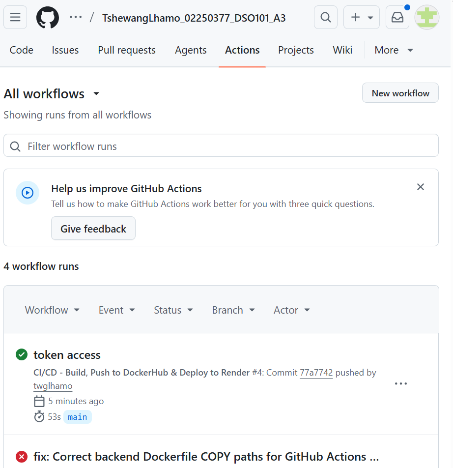
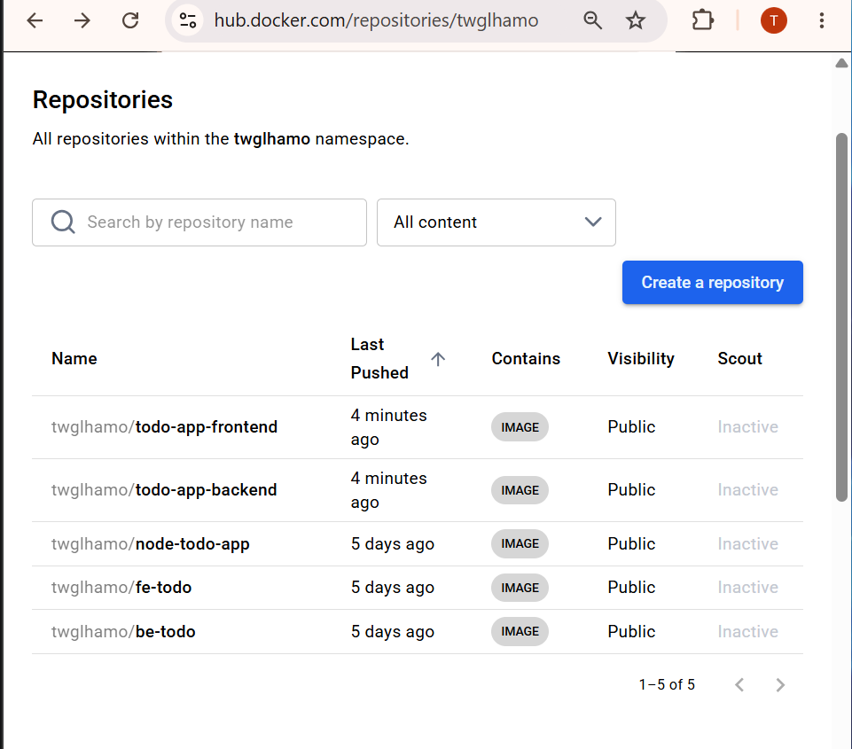
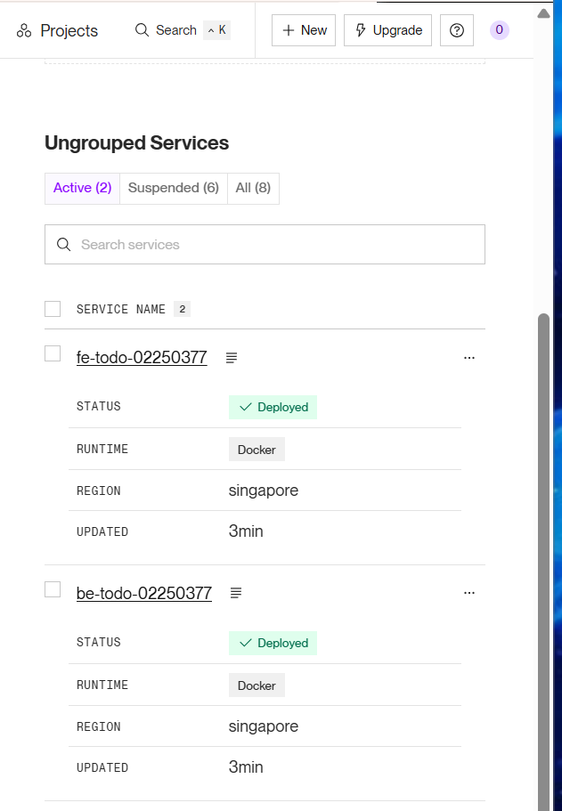
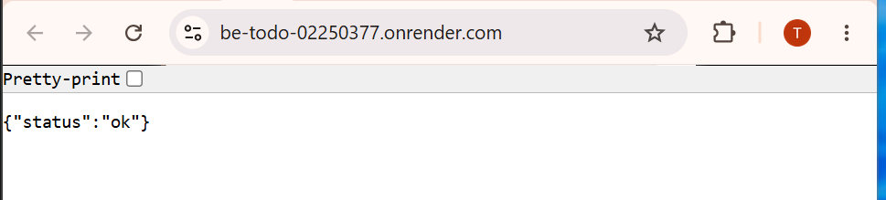
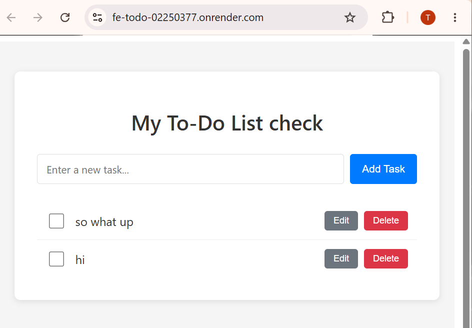

# DSO101 Assignment 3: CI/CD Automation with GitHub Actions

**Student:** Tshewang Lhamo  
**Student ID:** 02250377  
**Course:** DSO101 - Continuous Integration and Continuous Deployment  
**Program:** Bachelor's of Engineering in Software Engineering  
**Date of Submission:** May 14, 2026

**GitHub Repository:** https://github.com/twglhamo/TshewangLhamo_02250377_DSO101_A3

---

## ASSIGNMENT OBJECTIVE

Configure a complete **GitHub Actions CI/CD workflow** to automate:
1. Building Docker containers for the application
2. Pushing containers to DockerHub registry
3. Deploying containers on Render.com automatically
4. Triggering redeployments via Render webhooks

---

## DEPLOYMENT STATUS

**ASSIGNMENT 3 COMPLETE - FULL CI/CD AUTOMATION IMPLEMENTED**

### Live Services (May 14, 2026)

| Service | URL | Status | Auto-Deploy |
|---------|-----|--------|---|
| **Frontend** | https://fe-todo-02250377.onrender.com |  Deployed |  GitHub Actions |
| **Backend API** | https://be-todo-02250377.onrender.com | Deployed |  GitHub Actions |
| **DockerHub Frontend** | twglhamo/todo-app-frontend |  Public | Automated |
| **DockerHub Backend** | twglhamo/todo-app-backend |  Public |  Automated |

---

## STEPS TAKEN

### **Step 1: Repository Preparation**
-  Cloned Assignment 1 to-do application to Assignment 3 workspace
-  Verified GitHub repository is **public** (https://github.com/twglhamo/TshewangLhamo_02250377_DSO101_A3)
-  Confirmed `package.json` files contain required scripts:
  - Backend: `start`, `dev`, `test` scripts
  - Frontend: `build`, `dev`, `lint`, `preview` scripts

### **Step 2: Dockerfiles Update**
- Updated backend Dockerfile to use `node:20-alpine` (as per assignment requirements)
- Fixed Dockerfile COPY paths to work with GitHub Actions build context:
  ```dockerfile
  COPY backend/package*.json ./
  COPY backend/ .
  ```
- Frontend Dockerfile already properly configured with multi-stage build

### **Step 3: GitHub Actions Workflow Creation**
-  Created `.github/workflows/deploy.yml` with the following stages:
  1. **Checkout Code** - Retrieve repository contents
  2. **Setup Docker Buildx** - Enable multi-platform builds
  3. **Login to DockerHub** - Authenticate using secrets
  4. **Build & Push Backend Image** - Create and push `twglhamo/todo-app-backend`
  5. **Build & Push Frontend Image** - Create and push `twglhamo/todo-app-frontend`
  6. **Trigger Render Backend Deployment** - Call webhook to redeploy
  7. **Trigger Render Frontend Deployment** - Call webhook to redeploy
  8. **Deployment Summary** - Log completion details

**Workflow File Location:** [.github/workflows/deploy.yml](.github/workflows/deploy.yml)

### **Step 4: Configure GitHub Secrets**
Added four required secrets to GitHub repository (Settings → Secrets and variables → Actions):

| Secret Name | Purpose |
|---|---|
| `DOCKERHUB_USERNAME` | DockerHub username (twglhamo) |
| `DOCKERHUB_TOKEN` | Personal Access Token for Docker authentication |
| `RENDER_DEPLOY_WEBHOOK_BACKEND` | Webhook URL to trigger backend redeployment |
| `RENDER_DEPLOY_WEBHOOK_FRONTEND` | Webhook URL to trigger frontend redeployment |

### **Step 5: Retrieve Render Deploy Hooks**
-  Accessed each Render service (backend and frontend)
-  Navigated to Settings → Deploy Hook
-  Copied webhook URLs and added them as GitHub Secrets

### **Step 6: Test CI/CD Pipeline**
-  Made code changes and pushed to `main` branch
-  GitHub Actions workflow **automatically triggered**
-  Docker images successfully built and pushed to DockerHub
-  Render services redeployed automatically via webhooks
-  All services functioning without manual intervention

---

## PROOF: SCREENSHOTS

### 1️ DockerHub Token Creation

*Creating a personal access token for GitHub Actions authentication*

### 2️ DockerHub Tokens Configuration

*Configured "github-actions" token with Read & Write permissions*

### 3️ GitHub Secrets Configuration (Part 1)

*Added DOCKERHUB_TOKEN and DOCKERHUB_USERNAME as GitHub Secrets*

### 4 Render Deploy Hook Configuration

*Retrieved deploy hook from Render service settings*

### 5️ GitHub Secrets Configuration (Complete)

*All four required secrets configured:*
- DOCKERHUB_TOKEN
- DOCKERHUB_USERNAME
- RENDER_DEPLOY_WEBHOOK_BACKEND
- RENDER_DEPLOY_WEBHOOK_FRONTEND

### 6️ GitHub Actions Workflow Runs

*GitHub Actions dashboard showing successful workflow executions:*
-  "token access" run - Commit 77a7742
-  "fix: Correct backend Dockerfile COPY paths..." run
- Both runs completed successfully in 53 seconds

### 7️ DockerHub Pushed Images

*Docker images successfully pushed to DockerHub:*
-  **twglhamo/todo-app-frontend** - Pushed 4 minutes ago
-  **twglhamo/todo-app-backend** - Pushed 4 minutes ago
- Both marked as **Public**

### 8️ Render Services Redeployed

*Render dashboard showing deployed services:*
-  **fe-todo-02250377** - Status: **Deployed** (Docker runtime)
-  **be-todo-02250377** - Status: **Deployed** (Docker runtime)
- Updated: 3 minutes ago
- Both running in Singapore region

### 9️ Backend API Health Check

*Backend API endpoint verification:*
```json
GET https://be-todo-02250377.onrender.com
Response: {"status":"ok"}
```

### 10 Frontend Application Running

*Frontend application successfully deployed and running:*
- Title: "My To-Do List check"
- Fully functional interface with Add Task button
- Sample tasks: "so what up" and "hi"
- Edit and Delete buttons functional

---

## CHALLENGES FACED

### **Challenge 1: Docker Build Context Paths**
**Problem:** Initial workflow failed with error:
```
ERROR: failed to build: failed to solve: process "/bin/sh -c npm install --production" did not complete successfully: exit code: 254
```

**Root Cause:** The Dockerfile was using:
```dockerfile
COPY package*.json ./
COPY . .
```
But the build context couldn't find `package*.json` because they were in the `backend/` subdirectory.

**Solution:** Updated to explicitly reference the subdirectory:
```dockerfile
COPY backend/package*.json ./
COPY backend/ .
```

This ensures the Docker build command finds files correctly when run from the GitHub Actions context.

### **Challenge 2: Node.js Deprecation Warnings**
**Problem:** GitHub Actions workflow showed warning:
```
Node.js 20 actions are deprecated. The following actions are running on Node.js 20 and may not work as expected: actions/checkout@v4, docker/build-push-action@v5, etc.
```

**Resolution:** This is a known GitHub deprecation notice (scheduled for September 2026). Not a failure, but noted that action versions will need updating in the future to use Node.js 24.

### **Challenge 3: Render Webhook Configuration**
**Problem:** Initially unclear how to obtain the deploy webhook URLs from Render.

**Solution:** 
1. Navigate to Render service → Settings (left sidebar)
2. Scroll to **Deploy Hook** section
3. The webhook URL is displayed with a copy button
4. Store in GitHub Secrets for secure access

---

## LEARNING OUTCOMES

### 1. **GitHub Actions Automation**
- Learned how GitHub Actions workflows trigger on events (push, pull request, etc.)
- Understood workflow syntax (YAML format) with jobs, steps, and actions
- Discovered how to use community actions (docker/build-push-action, docker/login-action, etc.)
- Implemented conditional step execution (`if: success()`)

### 2. **Docker Registry Integration**
- Understood the difference between Docker images and registries
- Learned to authenticate with DockerHub via personal access tokens (more secure than passwords)
- Discovered image tagging best practices (`:latest` and `:commit-sha` tags)
- Understood public vs. private repository configurations

### 3. **CI/CD Pipeline Architecture**
- Grasped the concept of continuous integration (automated testing/building on code changes)
- Learned continuous deployment (automatically deploying to production)
- Understood webhook architecture for cross-platform automation
- Discovered how to manage secrets securely in CI/CD environments (never hardcode credentials!)

### 4. **Infrastructure as Code (IaC)**
- Workflow configuration stored in version control (`.github/workflows/`)
- Infrastructure changes tracked in Git (enabling rollback and audit trails)
- Reproducible deployments across different environments
- Declarative infrastructure definitions (YAML files)

### 5. **Docker Containerization Best Practices**
- Alpine Linux base images reduce image size and attack surface
- Multi-stage builds separate build and runtime dependencies
- Proper COPY paths are crucial in different build contexts
- Environment-specific Dockerfiles for frontend (Nginx) vs. backend (Node.js)

### 6. **Security & Secrets Management**
- Never hardcode credentials in code or configuration files
- Use GitHub Secrets to store sensitive information
- Personal Access Tokens provide granular permission control
- Webhook URLs should be treated as secrets (kept confidential)

---

## HOW THE CI/CD PIPELINE WORKS

### **Workflow Trigger**
```
Developer pushes code to 'main' branch
    ↓
GitHub detects push event
    ↓
GitHub Actions workflow triggered
```

### **Pipeline Execution**
```
1. Checkout Repository
   └─ Retrieve latest code from GitHub

2. Setup Docker Buildx
   └─ Enable advanced Docker build features

3. Login to DockerHub
   └─ Authenticate using DOCKERHUB_USERNAME + DOCKERHUB_TOKEN secrets

4. Build & Push Backend Image
   └─ Execute: docker build -t twglhamo/todo-app-backend:latest .
   └─ Push to DockerHub registry

5. Build & Push Frontend Image
   └─ Execute: docker build -t twglhamo/todo-app-frontend:latest .
   └─ Push to DockerHub registry

6. Trigger Render Webhooks
   └─ Call RENDER_DEPLOY_WEBHOOK_BACKEND
   └─ Call RENDER_DEPLOY_WEBHOOK_FRONTEND

7. Services Redeploy on Render
   └─ Render detects new images in DockerHub
   └─ Pulls latest images
   └─ Restarts services
   └─ Services available at live URLs
```

### **Result**
-  Production deployment completed in ~2-3 minutes
-  Zero manual intervention required
-  Consistent, repeatable deployments
-  Full audit trail in GitHub

---

## VERIFICATION

### **Test: Push Code Changes**
```bash
# Make a code change
echo "// test comment" >> backend/server.js

# Commit and push
git add .
git commit -m "test: CI/CD pipeline verification"
git push origin main
```

### **Verify Workflow Runs**
1. GitHub → Actions tab → See workflow execution
2. Check build logs for all steps completed successfully
3. Verify execution time: ~2-3 minutes typical

### **Verify DockerHub Push**
1. Visit https://hub.docker.com/repositories
2. Check "Last Pushed" timestamp for both images
3. Confirm images are **Public** and accessible

### **Verify Render Deployment**
1. Visit https://dashboard.render.com/
2. Check service "Updated" timestamp
3. Access live URLs to confirm working application

### **Verify Application Functionality**
- **Frontend:** https://fe-todo-02250377.onrender.com - UI loads, can add/edit/delete tasks
- **Backend:** https://be-todo-02250377.onrender.com - Returns `{"status":"ok"}`

---

##  PROJECT STRUCTURE

```
TshewangLhamo_02250377_DSO101_A3/
├── .github/
│   └── workflows/
│       └── deploy.yml                 # CI/CD workflow file
├── backend/
│   ├── Dockerfile                     # Backend containerization
│   ├── server.js                      # Express.js server
│   ├── package.json                   # Dependencies
│   └── .env.production                # Production environment vars
├── frontend/
│   ├── Dockerfile                     # Frontend containerization
│   ├── src/
│   │   ├── App.jsx
│   │   └── main.jsx
│   ├── package.json
│   └── vite.config.js
├── image/                             # Documentation screenshots
│   ├── 1.png - DockerHub token creation
│   ├── 2.png - DockerHub token list
│   ├── 3.png - GitHub secrets (part 1)
│   ├── 4.png - Render deploy hook
│   ├── 5.png - GitHub secrets (complete)
│   ├── 6.png - GitHub Actions runs
│   ├── 7.png - DockerHub pushed images
│   ├── 8.png - Render services
│   ├── 9.png - Backend API response
│   └── 10.png - Frontend app running
├── render.yaml                        # Render configuration
└── README_A3.md                       # This file
```

---

##  IMPORTANT LINKS

### **Repository & Code**
- GitHub Repository: https://github.com/twglhamo/TshewangLhamo_02250377_DSO101_A3
- Workflow File: [.github/workflows/deploy.yml](.github/workflows/deploy.yml)

### **Live Deployments**
- Frontend: https://fe-todo-02250377.onrender.com
- Backend: https://be-todo-02250377.onrender.com

### **Container Registry**
- DockerHub Profile: https://hub.docker.com/repositories/twglhamo
- Frontend Image: https://hub.docker.com/r/twglhamo/todo-app-frontend
- Backend Image: https://hub.docker.com/r/twglhamo/todo-app-backend

### **External Resources**
- [GitHub Actions Documentation](https://docs.github.com/en/actions)
- [Docker Best Practices](https://docs.docker.com/develop/dev-best-practices/)
- [Render Deploy Hooks](https://render.com/docs/deploy-hooks)
- [DockerHub Personal Access Tokens](https://docs.docker.com/security/for-developers/access-tokens/)

---

##  CONCLUSION

This assignment successfully demonstrated a **production-grade CI/CD pipeline** that:

 **Automates the entire deployment process** from code push to live application  
 **Eliminates manual deployment steps** reducing human error  
 **Provides traceability** with GitHub commit history linking to deployments  
 **Ensures consistency** by using containerized environments  
 **Implements security best practices** with encrypted secrets management  
 **Enables rapid iteration** with deployments in 2-3 minutes  

The pipeline demonstrates real-world DevOps practices used by major tech companies to maintain reliability and velocity in production systems.


